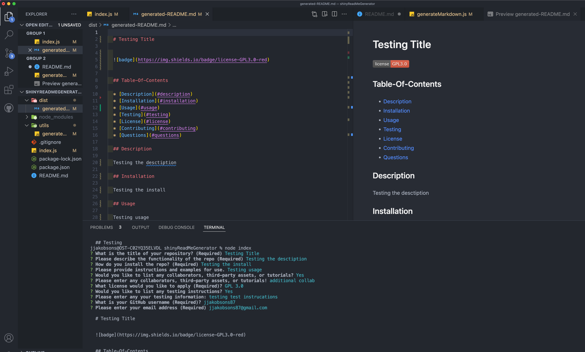

  # shinyReadMeGenerator

  

  ## Table-Of-Contents 

  * [Description](#description)
  * [Installation](#installation)
  * [Usage](#usage)
  * [Testing](#testing)
  * [License](#license)
  * [Contributing](#contributing)
  * [Questions](#questions)

  ## Description

  This application will take you through a series of questions to fill out information about your repository. Once all the way through, it will generate a readme file you can copy and paste into your README.

  ## Installation

  In order to install this application, you will first need Node.js on your local computer, then clone this repo. 
  ## Usage

  Once you have Node installed and the repo cloned, open terminal - either through VS code, or GitBase/Terminal, navigate to the project location, enter the prompt "node index". This will trigger the prompts of questions to generate your README!

  ## Testing 

  No specific testing instructions for this repo. 

  ## License

  This project is covered under the following license: 
  No-License

  For License information, please visit: 

  ## Contributing 

  No additional contribution call outs. 

  ## Questions 

  Any questions? Reach out to me via GitHub or Email!  
  [Github](https://github.com/jjakobsons87)  
  [Email](mailto:jjakobsons87@gmail.com)
  
  ## Screenshot and Video Recording 
  Link to video recording: https://drive.google.com/file/d/1enBd8vYhIdJ2oy2e5n83POoxEllzbodN/view 

  